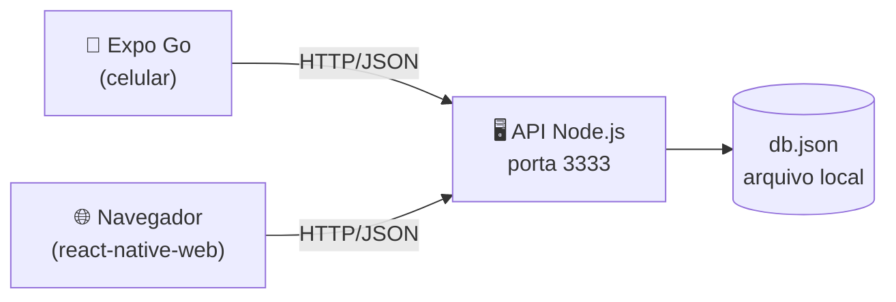

# ZapZap

Aplicativo de mensagens instantâneas para celular e navegador, construído com **React Native (Expo)** e uma **API REST própria em Node.js**.

Duas pessoas em dispositivos diferentes abrem o app, escolhem quem são e conversam — as mensagens aparecem dos dois lados, com contador de não lidas, confirmação de leitura e histórico persistente.

`React Native` · `Expo` · `Node.js` · `REST` · `JSON` · `Docker`

---

## Sumário

- [Funcionalidades](#funcionalidades)
- [Arquitetura](#arquitetura)
- [O ciclo de vida de uma mensagem](#o-ciclo-de-vida-de-uma-mensagem)
- [Organização do código](#organização-do-código)
- [A API](#a-api)
- [Modelo de dados](#modelo-de-dados)
- [Decisões técnicas](#decisões-técnicas)
- [Rodando o projeto](#rodando-o-projeto)
- [Limitações conhecidas](#limitações-conhecidas)
- [Próximos passos](#próximos-passos)

---

## Funcionalidades

### Identidade

- **Login com usuário e senha.** A senha nunca é gravada em texto: o servidor guarda o resultado do `scrypt` com um sal aleatório por conta. Usuário ou senha errados devolvem sempre a mesma mensagem, sem revelar se a conta existe.
- **Cadastro na própria tela**, com confirmação de senha, e já entrando logado.
- **Sessão por token.** O login devolve um token aleatório que o app envia em `Authorization: Bearer` a cada chamada. Toda rota, exceto cadastro e login, exige esse token.
- **Sair encerra a sessão de verdade:** o token é invalidado no servidor, não só esquecido no aplicativo.
- **Identidade separada da exibição.** O `usuario` é o login (único, sem espaços); o `nome` é como você aparece nas conversas e pode ser trocado quando quiser.
- **Endereço do servidor configurável.** Um `Switch` revela o campo onde se aponta o app para outro IP ou porta, útil quando a detecção automática não acerta a rede.

### Perfil editável

Toque no seu avatar, no topo da lista de conversas:

- **Trocar o nome exibido** (2 a 30 caracteres, sem repetir nome de outra pessoa). A mudança aparece para todos na próxima atualização — inclusive nas mensagens antigas, porque a mensagem guarda o `autorId`, não o nome. O login continua o mesmo.
- **Escolher a cor do avatar** entre oito opções.
- **Só o dono edita.** O servidor compara o id da URL com o dono do token: tentar editar o perfil alheio devolve 403.

### Lista de conversas

- **Ordenação por atividade.** A conversa que recebeu mensagem mais recentemente sobe para o topo.
- **Prévia da última mensagem**, prefixada por "Você:" quando foi você quem escreveu, ou pelo nome do autor quando é grupo.
- **Contador de não lidas** em badge verde, com o total agregado exibido no cabeçalho.
- **Horário inteligente:** hora do dia para mensagens de hoje, "Ontem" para o dia anterior, data completa para o resto.
- **Busca** que filtra por nome da conversa e também pelo conteúdo da última mensagem.
- **Filtro "não lidas"** para isolar o que ainda falta responder.
- **Puxe para atualizar** e atualização automática em segundo plano a cada 4 segundos.

### Conversas e grupos

- **Conversa individual:** selecione um contato e comece. Se já existir uma conversa entre vocês dois, o servidor devolve a existente em vez de criar uma duplicada.
- **Grupos:** selecione dois ou mais contatos e o campo de nome do grupo aparece automaticamente. Dentro do grupo, cada balão recebido mostra o nome do autor na cor do perfil dele.

### Tela de chat

- **Balões diferenciados:** verde e alinhados à direita quando são seus, brancos à esquerda quando recebidos.
- **Separadores de data** ("Hoje", "Ontem", "15 de março de 2026") inseridos automaticamente entre os dias.
- **Confirmação de leitura:** ✓ quando a mensagem foi enviada, ✓✓ azul quando outro participante abriu a conversa.
- **Envio otimista:** sua mensagem aparece na tela assim que o servidor confirma, sem esperar o próximo ciclo de atualização.
- **Recebimento automático** a cada 2,5 segundos enquanto a tela está aberta.
- **Apagar mensagem** com toque longo (ou clique longo, na web) — só as suas, com confirmação antes.
- **Contador de caracteres** que aparece quando você se aproxima do limite de 1000.
- **Teclado que não cobre o campo de digitação**, via `KeyboardAvoidingView`.

### Robustez e experiência

- **Validação em duas camadas:** o app barra entradas inválidas antes de gastar rede, e o servidor repete as mesmas regras — mais as de autorização (só participante envia na conversa, só o autor apaga a própria mensagem).
- **Erros legíveis.** Em vez de "Network request failed", a mensagem diz qual endereço falhou e o que verificar. Requisições têm tempo limite de 10 segundos para não travar a interface.
- **Estados vazios ilustrados** para lista sem conversas, busca sem resultado e chat sem mensagens.
- **Indicadores de carregamento** em cada operação assíncrona.
- **Histórico persistente:** os dados ficam em arquivo no servidor e sobrevivem a reinicializações.
- **Funciona na web e no celular** com o mesmo código-fonte, inclusive o `Alert`, que tem uma implementação compatível com navegador.

---

## Arquitetura

Três peças independentes conversando por HTTP:



O app **não guarda estado no dispositivo**: toda informação vem da API a cada requisição. Isso mantém os dispositivos sincronizados sem lógica de resolução de conflitos e torna o comportamento fácil de inspecionar — qualquer tela pode ser reproduzida com um `curl`.

O servidor é um processo Node único, escrito apenas com módulos nativos (`http`, `fs`, `path`, `os`). Não há Express, banco de dados nem `npm install`: o roteamento é feito com comparação de caminho e expressões regulares, e a persistência é um `JSON.stringify` em arquivo.

---

## O ciclo de vida de uma mensagem

1. Você digita e toca em enviar. O app valida: texto não vazio, dentro do limite.
2. `POST /mensagens` com `{ conversaId, autorId, texto }`.
3. O servidor confere se a conversa existe e se você participa dela, gera `id` e `criadaEm`, marca a mensagem como já lida por você e grava o arquivo.
4. A resposta `201` volta com a mensagem completa e o autor embutido — o app a acrescenta na lista imediatamente.
5. No celular do destinatário, o ciclo de atualização (a cada 2,5 s) faz `GET /mensagens?conversaId=…` e a mensagem aparece.
6. Ao abrir a conversa, o app dispara `POST /conversas/:id/lida`, que adiciona o usuário ao campo `lidaPor` de cada mensagem.
7. No seu aparelho, o próximo ciclo enxerga `lidaPor` com dois nomes e o ✓ vira ✓✓.

---

## Organização do código

```
zapzap/
├── servidor/server.js          API completa em um arquivo, sem dependências
└── app-expo/
    ├── App.js                  navegação por estado: login → conversas → chat
    └── src/
        ├── api.js              toda comunicação HTTP concentrada aqui
        ├── tema.js             cores e espaçamentos
        ├── utils.js            datas, iniciais, alertas compatíveis com web
        ├── componentes/        Avatar, Balao, ItemConversa, Vazio
        └── telas/              TelaLogin, TelaConversas, TelaChat, TelaNovaConversa
```

Nenhuma tela chama `fetch` diretamente: elas importam funções de `api.js`. Trocar o endereço do servidor, adicionar cabeçalho de autenticação ou migrar para WebSocket mexe em um arquivo só.

---

## A API

Base: `http://localhost:3333`

| Método | Rota | O que faz |
|---|---|---|
Rotas públicas:

| Método | Rota | O que faz |
|---|---|---|
| `GET` | `/health` | diagnóstico e totais |
| `POST` | `/usuarios` | cadastro — devolve `{ token, usuario }` |
| `POST` | `/login` | autenticação — devolve `{ token, usuario }` |

Rotas protegidas (exigem `Authorization: Bearer <token>`):

| Método | Rota | O que faz |
|---|---|---|
| `GET` | `/eu` | dados da conta logada |
| `POST` | `/logout` | invalida o token |
| `GET` | `/usuarios` | lista contas (sem senha) |
| `PUT` | `/usuarios/:id` | troca o nome exibido e a cor |
| `GET` | `/conversas` | conversas de quem está logado |
| `POST` | `/conversas` | cria (ou reaproveita) conversa individual ou grupo |
| `POST` | `/conversas/:id/lida` | marca todas as mensagens como lidas |
| `GET` | `/mensagens?conversaId=1&depoisDe=0` | mensagens da conversa |
| `POST` | `/mensagens` | envia mensagem (o autor vem do token) |
| `DELETE` | `/mensagens/:id` | apaga a própria mensagem |

Códigos de resposta: `200`/`201` sucesso · `400` validação · `401` não autenticado · `403` sem permissão · `404` não encontrado · `409` usuário ou nome duplicado · `500` erro interno.

Experimente sem abrir o app:

```bash
curl http://localhost:3333/health

# login guarda o token em uma variável
TOKEN=$(curl -s -X POST http://localhost:3333/login \
  -H "Content-Type: application/json" \
  -d '{"usuario":"ana","senha":"123456"}' | grep -o '"token":"[^"]*' | cut -d'"' -f4)

curl http://localhost:3333/conversas -H "Authorization: Bearer $TOKEN"

curl -X POST http://localhost:3333/mensagens \
  -H "Content-Type: application/json" -H "Authorization: Bearer $TOKEN" \
  -d '{"conversaId":1,"texto":"testando a API"}'

# trocar o nome exibido
curl -X PUT http://localhost:3333/usuarios/1 \
  -H "Content-Type: application/json" -H "Authorization: Bearer $TOKEN" \
  -d '{"nome":"Ana Paula"}'
```

---

## Modelo de dados

Tudo vive em `servidor/db.json`, criado na primeira execução com três perfis e duas conversas de exemplo.

```json
{
  "usuarios":  [{
    "id": 1, "usuario": "ana", "nome": "Ana", "cor": "#25D366",
    "senhaHash": "b3f1…", "sal": "9c2a…"
  }],
  "sessoes":   [{ "token": "a1b2…", "usuarioId": 1, "criadaEm": "2026-08-28T00:15:47.808Z" }],
  "conversas": [{ "id": 1, "titulo": null, "participantes": [1, 2] }],
  "mensagens": [{
    "id": 1, "conversaId": 1, "autorId": 2,
    "texto": "Oi Ana!", "criadaEm": "2026-08-27T18:49:42.340Z",
    "lidaPor": [2]
  }]
}
```

Duas decisões de modelagem que carregam bastante comportamento:

- **`titulo: null` identifica conversa individual.** Sem título, o nome exibido é o do outro participante — por isso a mesma conversa aparece como "Bruno" para a Ana e como "Ana" para o Bruno, sem duplicar dado.
- **`lidaPor` é uma lista, não um booleano.** Isso faz o contador de não lidas e o ✓✓ funcionarem igual em conversa individual e em grupo com cinco pessoas.
- **`usuario` e `nome` são campos diferentes.** O login identifica a conta e nunca muda; o nome é só apresentação e pode ser trocado sem quebrar sessões, mensagens antigas ou conversas.
- **`senhaHash` e `sal` nunca saem do servidor.** Toda resposta passa por uma função que remove esses campos antes de virar JSON.

---

## Decisões técnicas

**Por que atualização por intervalo em vez de WebSocket.** O ciclo periódico (*polling*) usa o mesmo HTTP do resto do app, funciona atrás de qualquer firewall e cabe em poucas linhas dentro de um `useEffect`. Um WebSocket entregaria latência menor e menos requisições, mas exigiria biblioteca extra, tratamento de reconexão e um servidor com estado. Para o objetivo do projeto, o intervalo curto dá a sensação de tempo real com uma fração da complexidade — e a troca está isolada em `api.js`, caso alguém queira fazer a migração como exercício.

**Por que nenhuma biblioteca de navegação.** Com quatro telas e uma transição linear, `useState` no `App.js` resolve. Evita uma dependência pesada e deixa visível o mecanismo que uma biblioteca esconderia.

**Por que um servidor sem dependências.** Zero `npm install`, zero risco de versão incompatível, e o arquivo inteiro pode ser lido de ponta a ponta em minutos. Roteamento, CORS, leitura de corpo e persistência ficam explícitos, em vez de acontecerem dentro de um framework.

**Por que validar duas vezes.** No cliente, para dar retorno imediato e não gastar rede. No servidor, porque `curl` ignora qualquer validação de tela — regra que só existe no cliente não é regra.

**Por que os hooks memorizados.** `fetchAll` e afins vivem dentro de `useCallback` porque são dependência de `useEffect`. Sem a referência estável, cada renderização recriaria o efeito, que dispararia outra requisição, que causaria outra renderização — o clássico laço infinito de requisições.

---

## Rodando o projeto

Você precisa apenas de **Node.js LTS**. Em dois terminais:

```bash
# terminal 1 — a API (sem npm install: usa só módulos nativos)
cd servidor
node server.js

# terminal 2 — o app
cd app-expo
npm install
npx expo install react-dom react-native-web @expo/metro-runtime
npx expo start
```

> Contas de exemplo criadas na primeira execução do servidor: **ana**, **bruno** e **carla**, todas com a senha **123456**.

Depois tecle `w` para abrir no navegador, ou escaneie o QR Code com o **Expo Go** (celular na mesma rede Wi-Fi do computador). Para ver o chat dos dois lados, abra uma segunda aba anônima e entre com outro perfil.

O app descobre sozinho o IP do servidor; se precisar apontar manualmente, use "Configurar servidor" na tela inicial.

> Prefere containers? O [DOCKER.md](DOCKER.md) traz a instalação do Docker no Windows e o `docker compose up --build`, que sobe a API e a versão web juntas.

---

## Limitações conhecidas

Explicitar o que o projeto **não** faz vale tanto quanto listar o que ele faz:

- **Sem criptografia no transporte.** O tráfego é HTTP puro em rede local: a senha vai protegida por hash **no armazenamento**, mas trafega legível na rede. Em produção isso exigiria HTTPS.
- **Token sem expiração.** A sessão só termina no logout; não há prazo de validade nem renovação.
- **Token só na memória do app.** Fechou o aplicativo, precisa entrar de novo (dá para resolver com `AsyncStorage`).
- **Sem recuperação de senha.** Esqueceu, perdeu a conta.
- **Mensagens em texto plano** no `db.json` — sem criptografia ponta a ponta.
- **Persistência em arquivo único.** O `db.json` é reescrito inteiro a cada gravação — adequado para uma turma, não para milhares de mensagens.
- **Sem paginação.** A tela de chat carrega o histórico completo da conversa.
- **Latência de até 2,5 segundos** para receber, consequência do modelo de atualização por intervalo.
- **Sem envio de mídia.** Só texto.

---

## Próximos passos

Boas extensões para quem quiser continuar o projeto:

1. Trocar o intervalo de atualização por **WebSocket** e comparar tráfego e latência.
2. **Trocar a senha** dentro do perfil, exigindo a senha atual.
3. **Editar mensagem** (`PUT /mensagens/:id`) e indicador de "editada".
4. **"Digitando…"** no cabeçalho do chat.
5. **Paginação** do histórico ao rolar para cima.
6. Guardar o token com **AsyncStorage** para não fazer login toda vez, e dar validade a ele.
7. **Notificações push** com `expo-notifications`.
8. Migrar o `db.json` para **SQLite** ou **PostgreSQL**.

---

## Licença

Uso livre para fins educacionais. Desenvolvido como trabalho da disciplina de **Sistemas de Informação**, com foco em consumo de APIs REST em aplicações móveis.
